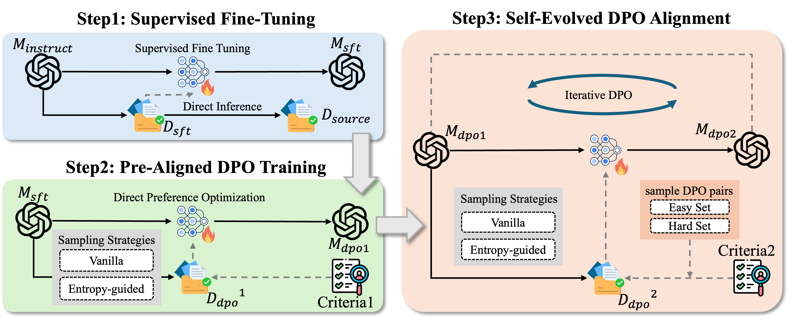
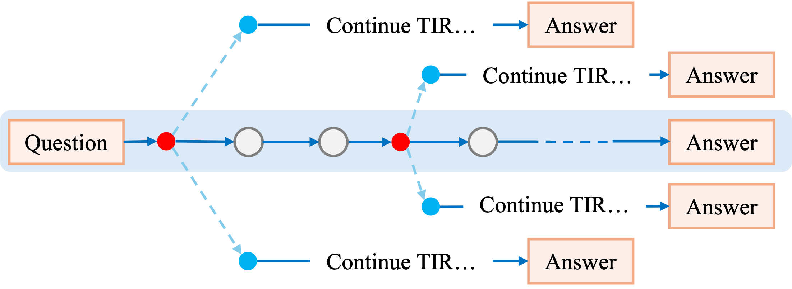

<h1 align="center"> 💡Toward Effective Tool-Integrated Reasoning via
Self-Evolved Preference Learning</a></h1>

<!-- <div align="center"> 

[](https://huggingface.co/collections/dongguanting/arpo-688229ff8a6143fe5b4ad8ae)
[](https://modelscope.cn/models/dongguanting/arpo-688229ff8a6143fe5b4ad8ae)
[](https://opensource.org/licenses/MIT) 
[](https://www.python.org/downloads/release/python-390/) 
</div> -->

<div align="center">
  <a href="https://huggingface.co/zhangboguodong/Tool-Light-Qwen2.5-7B-it">
    
  </a>
  <a href="https://modelscope.cn/models/zhangboguodong/Tool_Light_Qwen2.5_7B_it">
    
  </a>
  <a href="https://opensource.org/licenses/MIT">
    
  </a>
  <a href="https://www.python.org/downloads/release/python-390/">
    
  </a>
</div>


## 😃 Overview


**Tool-Light** is a framework focused on enabling models to efficiently complete TIR tasks. Tool-Light innovatively introduces the **Entropy-Guided Sampling Strategy** to construct the training set. Besides, it trains the model through the **Self-Evolved DPO Pipeline**. This design empowers the model to gradually acquire the ability to call tools efficiently and accurately. Results on two types of reasoning tasks demonstrate superior performance compared to traditional methods.

<!-- <p align="center">

</p> -->


## 😋 Quick Start for Data Construction
### 1. Environment Setup

In this step, we should first operate SFT on Qwen2.5-7B-Instruct model. Please first set up the environment for [Llama Factory](https://github.com/hiyouga/LLaMA-Factory).

```bash
git clone https://github.com/asilverlight/Tool-Light/
cd Tool-Light/LLaMA-Factory-main

conda create -n sft python=3.10
conda activate sft

pip install -r requirements.txt
```

### 2. Conduct SFT on Qwen2.5-7B-Instruct

1. Download your SFT dataset from [🤗Tool-Star-SFT-54K](https://huggingface.co/datasets/dongguanting/Tool-Star-SFT-54K) and place it in `LLaMA-Factory-main/data/final_sft_edition9.json`. Define the dataset in `dataset_info.json`. By the way, [Tool-Star](https://github.com/RUC-NLPIR/Tool-Star) is also a wonderful work:)

2. In `LLaMA-Factory-main/examples/train_full/llama_factory.sh`, execute the following codes:

```bash
conda activate sft
module load cuda/12.1.1
cd /path/to/LLaMA-Factory-main
CUDA_VISIBLE_DEVICES=0,1,2,3 llamafactory-cli train /path/to/LLaMA-Factory-main/examples/train_full/sft.yaml
```
### 3. Inference Environment Setup
First, configure the required environment.
```bash
conda create -n inference python==3.10
conda activate inference
cd /path/to/Tool-Light/evaluation
pip install -r requirement.txt
```
### 4. Use SFT Model to Select Source Datas
Use the SFT model to directly perform inference on `LLaMA-Factory-main/data/final_sft_edition9.json`, and screen out the data sources for DPO training. You can execute the following code:
```bash
bash entropy_guided_sample/run.sh
```
### 5. Use Two Strategies to Sample Datas
Based on the data sources you've screened out, use the SFT model for sampling.

Execute the following code in `entropy_guided_sample/vanilla_sample.sh` for Vanilla Sampling:
```bash 
export CUDA_VISIBLE_DEVICES=0,1
export TOKENIZERS_PARALLELISM=true
module load cuda/12.5.1
module load gcc/13.1.0
python vanilla_sample.py \
    --model_path /path/to/your_model \
    --gpu_use 0.95 \
    --temperature 1 \
    --max_tokens 8000 \
    --max_input_len 32768 \
    --output_path /path/to/your_output.json \
    --batch_size 128 \
    --counts 4000 \ # the number of questions to sample
    --data_path /path/to/your_data.json \
    --rollout_counts 10 # max rollout counts for each question
```
Execute the following code in `entropy_guided_sample/entropy_guided_sample.sh` for Entropy-Guided Sampling:
```bash 
export CUDA_VISIBLE_DEVICES=0,1
export TOKENIZERS_PARALLELISM=true
module load cuda/12.5.1
module load gcc/13.1.0

python entropy_guided_sample.py \
    --model_path /path/to/your_model \
    --gpu_use 0.95 \
    --temperature 1 \
    --max_tokens 4096 \
    --max_input_len 32768 \
    --output_path /path/to/your_output.json \
    --batch_size 100 \
    --counts 4000 \ # the number of questions to sample
    --data_path /path/to/your_data.json \
    --max_rollout_steps 3 \ # the number of branch points
    --max_rollout_counts 3 # the number of branches at each position
```

### 6. Construct Positive-Negative Examples According to Criteria
For Pre-Aligned DPO and Self-Evolved On-Policy DPO parts, we design different criteria for screening positive-negative examples. You can refer to the description in the paper, and then construct the training set for the two types of sampled data.

## 🥰 Self-Evolved DPO Training
### 1. Environment Setup
This part is the same as **Environment Setup** in **Quick Start for Data Construction**.
### 2. Conduct DPO Training
1. Define your constructed DPO dataset in `dataset_info.json`.

2. In `LLaMA-Factory-main/examples/train_full/llama_factory.sh`, execute the following codes:

```bash
module load cuda/12.1.1
conda activate sft
cd /path/to/LLaMA-Factory-main
CUDA_VISIBLE_DEVICES=0,1 llamafactory-cli train /path/to/LLaMA-Factory-main/examples/train_full/step1_dpo.yaml
```
3. Enter the `inference` environment. Then, use the DPO model to sample again from the same 4000 data sources. After that, screen the positive-negative examples according to the criteria of the Self-Evolved On-Policy DPO Loop phase.

4. Define this phase's training data, and execute the following codes in `LLaMA-Factory-main/examples/train_full/llama_factory.sh`:
```bash
module load cuda/12.1.1
conda activate sft
cd /path/to/LLaMA-Factory-main
CUDA_VISIBLE_DEVICES=0,1 llamafactory-cli train /path/to/LLaMA-Factory-main/examples/train_full/step2_dpo.yaml
```
### 3. Evaluate the Performance of Trained Model

1. Enter the `inference` environment.

2. Deploy the retriever for performing search tasks on Wikipedia-based datasets. We provide a Wikipedia retriever service implemented using FlashRAG and FastAPI. Before starting the retriever serving, you need to download the [pre-indexed Wikipedia](https://github.com/RUC-NLPIR/FlashRAG?tab=readme-ov-file#index), [Wikipedia corpus, and corresponding retriever models](https://github.com/RUC-NLPIR/FlashRAG/blob/main/docs/original_docs/reproduce_experiment.md#preliminary). The corpuses used can be found [here](https://huggingface.co/datasets/RUC-NLPIR/FlashRAG_datasets/tree/main/retrieval-corpus), and Index construction method can be found [here](https://github.com/RUC-NLPIR/FlashRAG/tree/main?tab=readme-ov-file#rocket-quick-start).

More details can be found in the [FlashRAG documentation](https://github.com/RUC-NLPIR/FlashRAG/tree/main?tab=readme-ov-file#rocket-quick-start).

To start the retriever serving, first fill in `evaluate/retriever/serving_config.yaml` with the correct paths to the retrieval model, index, and corpus, as well as available GPU IDs. Then, run the following command to start the retriever serving:

```bash
python host_wiki.py \
    --config serving_config.yaml \
    --num_retriever {num_retriever} \
    --port {port}
```
3. Begin for inference. First, you should create an environment for vllm:

```bash
cd /path/to/Tool-Light/evaluation
conda create -n vllm python=3.10
conda activate vllm
pip install -r vllm_env/requirements.txt
```


Then, execute code in `Tool-Light/evaluation/infer_local_sds.sh` to conduct inference. 

- First, serve the reasoning model by running the code in `Tool-Light/evaluation/vllm_launch_reasoning_model-1.sh` and `Tool-Light/evaluation/vllm_launch_reasoning_model-2.sh`:
```bash
bash evaluate/vllm_launch_reasoning_model-1.sh
bash evaluate/vllm_launch_reasoning_model-2.sh
```

- Then, run the code in `Tool-Light/evaluation/infer_local_sds.sh` for inference:
```bash
bash evaluate/infer_local_sds.sh
```
4. After that, you can test the metrics of the model.

- First, run the code in `Tool-Light/evaluation/deploy_qwen2.5_72B_instruct.sh` to deploy the judging model.
```bash
bash evaluate/deploy_qwen2.5_72B_instruct.sh
```


- Then, run the code in `Tool-Light/evaluation/evaluate_all_datas.sh` to evaluate the performance of the model. Here, we evaluate the **F1 score** and the **LLM-as-Judge** metric.
```bash
bash evaluate/evaluate_all_datas.sh
```

More details for evaluation can be found in [ARPO](https://github.com/RUC-NLPIR/ARPO).

5. For the measurement of the **Efficiency** and **Necessity** metrics, please run `evaluate/calculate_metrics.sh`:
```bash
export PYTHONPATH=/path/to/Tool-Light/:$PYTHONPATH

data_names=(
    "hotpotqa"
    "2wiki"
    "bamboogle"
    "musique"
    "aime24"
    "aime25"
    "gsm8k"
    "math"
    "math500"
    "amc23"
)

methods=(
    "efficiency"
    "necessity"
)

for data_name in "${data_names[@]}"; do
    for method in "${methods[@]}"; do
        echo "Calculating metrics for $data_name with method $method"
        python calculate_metrics.py \
            --output_path /path/to/${method}/${data_name}_${method}.json \
            --other_paths /path/to/search_o1/Search_o1_${data_name}_result.metrics.json,/path/to/search_r1/Search_R1_${data_name}_result.metrics.json,/path/to/recall/ReCall_${data_name}_result.metrics.json,/path/to/dotamath/DOTAMATH_${data_name}_result.metrics.json,/path/to/torl/ToRL_${data_name}_result.metrics.json,/path/to/prompt_base/Prompt_Base_${data_name}_result.metrics.json,/path/to/retool/ReTool_${data_name}_result.metrics.json,/path/to/tool_star_7b_sft/Tool-Star-SFT_${data_name}_result.metrics.json,/path/to/tool-light/Tool-Light_${data_name}_result.metrics.json \
            --exp_type $method \
            --dataset $data_name \
            --model_path /path/to/Qwen2.5-7B-Instruct
    done
done
```
 Note that for the measurement of these two metrics, you need to run `Tool-Light/evaluation/evaluate_all_datas.sh` before. For the measurement of **Necessity**, you need to obtain the F1 scores and the LLM-as-Judge metrics for all baselines in advance.
